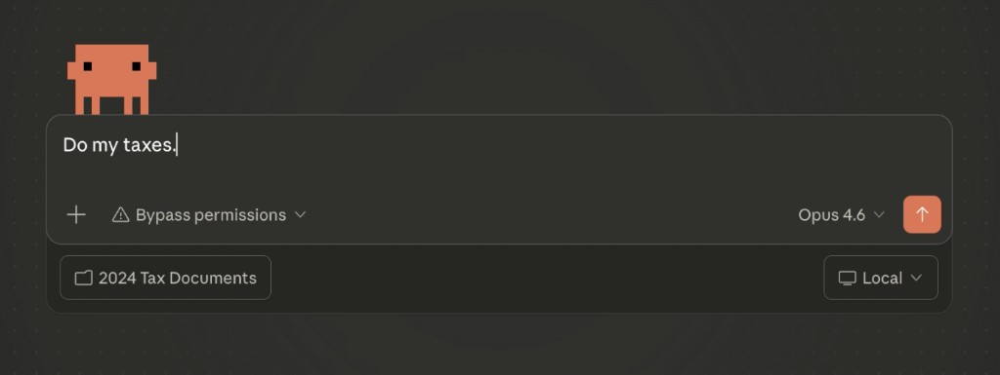
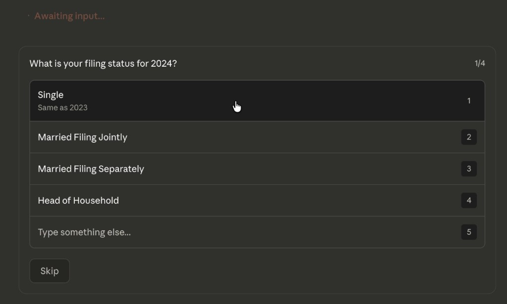
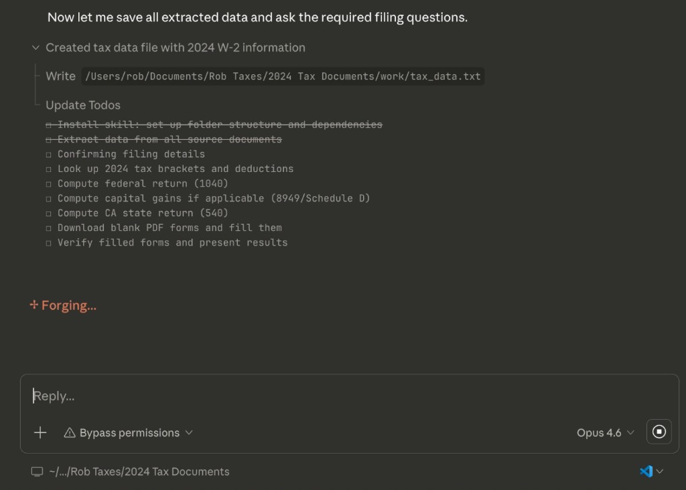
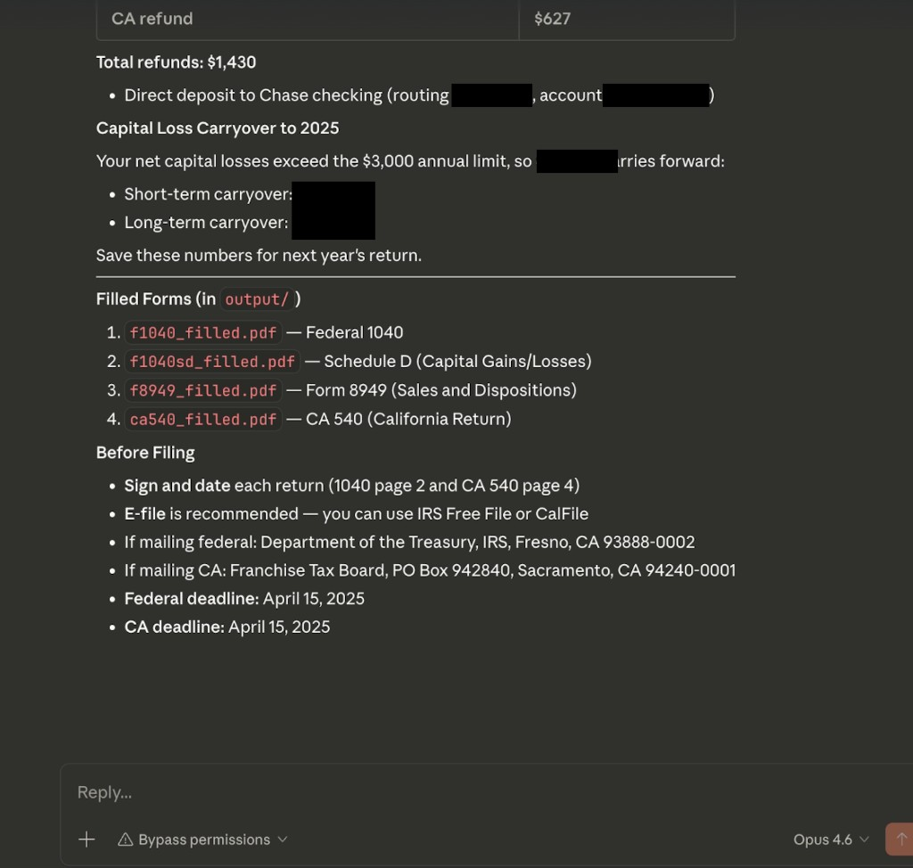

# Tax Filing Skill for Claude Code

This Skill helps Claude turn a folder of tax documents into a mostly-complete filing workflow: read the source docs, compute the return, fill the forms, and hand back a clear summary of what to review before filing.

**Repository:** [github.com/idsts2670/claude-tax-filing-IL](https://github.com/idsts2670/claude-tax-filing-IL) — maintained by [@idsts2670](https://github.com/idsts2670) (Satoshi Ido).

## What It Does

- Reads W-2s, 1099s, brokerage statements, and prior-year returns
- Asks the missing filing questions Claude needs to finish the return
- Computes federal and state tax results, including capital gains and carryovers
- Downloads official blank PDF forms and fills them programmatically
- Verifies outputs and returns a human-friendly summary of refunds, forms, and next steps

## Installation

**Prerequisites:** Install [uv](https://docs.astral.sh/uv/) for fast Python environment management:
```bash
# macOS/Linux
curl -LsSf https://astral.sh/uv/install.sh | sh

# Windows  
powershell -ExecutionPolicy ByPass -c "irm https://astral.sh/uv/install.ps1 | iex"
```

**Skill Installation:**

1. Upload `tax-filing-skill.zip` to Claude as a Skill.
2. Or point Claude at this repo: [github.com/idsts2670/claude-tax-filing-IL](https://github.com/idsts2670/claude-tax-filing-IL).

Then point Claude at your tax documents folder and say something like:

```text
Do my taxes using this Skill.
```

## What It Looks Like

Start with a simple prompt:



Claude asks the follow-up questions needed to finish the return:



It works through the filing steps and keeps track of progress:



At the end, it gives you a clean summary of refunds, carryovers, and filled forms:



## What You Get

- Filled PDF forms in `output/`
- A summary of federal and state results
- Any carryover values to save for next year
- A checklist of what to sign, review, and file

## What We've Learned

Skills are not just a single `.md` file anymore. They can also include scripts, code snippets, and example files, which makes them much more powerful.

## Contributing

Contributions are welcome via PR.
